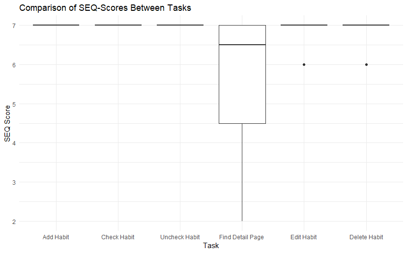

# BetterBee
### by Kaja (cc231049) & Zsanett (cc231070)
### [Repository here!](https://github.com/GegenteilVonGegenteil/BetterBee/tree/master)

## Description
BetterBee: An application for tracking daily habits. Users can create, edit, delete the habits they want to keep track of in their day-to-day. 
Habits can be checkmarked as done and are reset daily.

## App Development
### Use case
Chosen Use Case: B - Wellbeing \
BetterBee would be used to help users who want to create a habit in their lives by keeping track of daily habits in the application and checking them off when they have been completed.

### Target User
* People who struggle with or want to get better at habits and routine
* People ages 18-39
* All genders
* All countries (but english speaking individuals)

### User Flow

### Mockups

### Screen Design

### Database Design

## Reflection
### Kaja
#### Contribution
Data Layer, Reset, Home/Manage/Detail Pages, User Testing, User Test Plan

#### Challenges
The biggest challenge for me was the reset, since we intended to do it at midnight with a WorkManager. While the it theoretically worked as intended, when the app was open on reset, the phone would kill the scheduler upon closing the app, removing the purpose of the WorkManager. After two days of debugging and help from lecturers, we still couldn't figure out why this behavior was happening, as it seemed to be an issue with android, not the app. So we decided to do it differently, which wasn't hard to code, but not our intended way and also meant we didn't expand the WorkManager to do Notifications.

#### Meeting the initial concept
I think the app meets the inital concept completely, as users are able to create habits with custom names and color selection and edit/delete them, as well as them being able to check them off every day, with them resetting every day. We expanded on that concept with the detail view, which also offers insight into the history of habit completion.

#### Further Improvements
I think there are many ways to build onto the app. Most importantly, I think the ability to set custom intervals for habits would be nice, as well as notifications to remind the user to do them. A way to sort the order of the tasks would also be a great way for further customization. Lastly, a way to retroactively change entries would be helpful.

### Zsanett
#### Contribution
Design Director, logo design, Add/Edit Pages, Presentations, User Test Plan, code commenting

#### Challenges
The colour buttons for a habit were something I initially wanted to do in the form of a menu, with the colours all being visible as they are. I also tried it as radio buttons, and landed on them being buttons in a row. I don't know still what is standard or if there are accessibility issues with this format, and whether there is a better way of doing this. What I ended up with fits the design plan, though.
There were also some challenges with git, as the initial 2 repositories did not work, and then wit the one that did work, my commits were registered under another account due to saved data on the borrowed laptop I worked from.
The main issue overall was figuring out everything in Android/Kotlin; Planning the code, restructuring and changing how we did things based on the development and things not working over the course of the first week and what new information we got about best practice. We had to go back and forth with some things and be adaptable to changing plans a few times; Luckily, we work well together and could plan code together well with my partner, and with the help of tutors.

#### Meeting the initial concept
The initial concept was met completely, we had our MVP at the start met and added slightly more to it. Our MVP included habits that can be checked off, reset every day, custom names for them and choosing a colour for each (CRUD). What we did above that is the splash screen when launching the app, and the detail view of the app with a calendar history and overview of the completion rate.

#### Further Improvements
There are many ways to add to this app, most of which we have already discussed we may continue working on in the future. The main ones would be the possibility to have habits be for different intervals (weekly, monthly), adding notifications, being able to reorder the habits in the manage page. Retroactively changing the completion of the habits on days past could be added too, along with statistics being more extensive and visualised on the detail page. These are the main/first improvements, with there being a last one that is more extensive: We discussed adding 'progress' indicators: that when a habit is in the state of being done e.g. 90% of the time or above, there would be a visual indicating that, such as a bee or a change in how the habit looks.

## User Test Planning
### Heuristic Evaluation
System should generally be easy to use and navigate, due to its minimalistic design. However, the system status isn’t visible, there is no way to prevent errors or recover and no further documentation might leave users alone with their problems.

### Initial Questions
* How simple do the users find the app to be? (DV: Ease of use)
* How do users asses the usability of the app? (DV: Usability/SUS Score)
* What features could be improved or added according to users? (DV: Features to improve/add)

### Methods
* Test subject is given a phone with the app opened.
* Test subject is asked to perform certain scenarios (Add Habit, Mark Habit, Unmark Habit, Edit Habit, Delete Habit) and is then given a SEQ. Test subject is also encouraged to think out loud while performing the tasks.
* After the tasks, participants are given a SUS-Questionaire to fill out.
* Afterwards, a short interview is conducted to assess potential improvements and wishes by test subject.

### Results
#### Participants
* **Amount:** 8 participants
*  **Gender:** 5 Men, 3 Women
* **Age:** 7 20-29, 2 30-39 (M = 25.25, SD = 6.45)

#### Quantitative Evaluation
* **SUS-Scores:** The app generally got favourable SUS-scores  (M = 93.75, SD = 5.98), with the minimum being 82.50 and the maximum 100.
* **SEQ-Scores:** Users generally found finishing the tasks very easy, getting a SEQ-rating of 7 across the board, with the exception of Tasks 5 and 6 whih had one rating of 6 each, as well as Task 4 (Finding the deatil page), which got mixed scores, ranging from 2 to 7  M = 5.5, SD = 1.87).

#### Qualtitative Feedback
Users generally said they liked our app. Two people mentioned that they would like a popup before deleting a habit. Most participants also expressed that clicking on the habit for a detail view wasn't intuitive. Otherwise, users mentioned some changes to design, adding a general calendar and notifications, among other small adjustments.

#### Changes to Product
Based on the feedback, we changed that the habit colors persist when a habit is crossed out, added a delete popup, fixed a routing bug that would occur under specific circumstances by making the navigation more efficient and made habits clickable in the manageview to give users more ways to get to the detail view.
